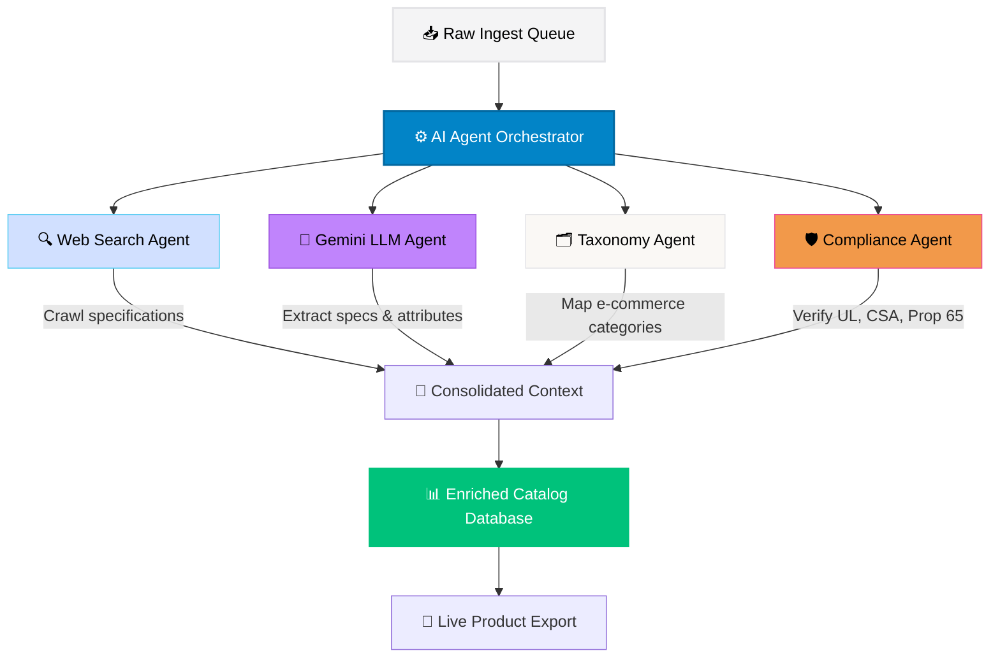

# 🧬 CatalogIQ —- AI-Powered Enterprise Product Catalog Ingestor

[](https://unihack-catalogiq.vercel.app)
[](https://nextjs.org)
[](https://deepmind.google/technologies/gemini)
[](https://www.typescriptlang.org)
[](https://biomejs.dev)

**CatalogIQ** is a next-generation enterprise-grade catalog enrichment and compliance validation platform. Built for distributors, retailers, and manufacturing giants, it ingests messy, unstructured vendor data sheets (PDFs, supplier logs, raw text) and structures them into clean, standardized, e-commerce-ready product catalogs.

🌐 **Live Production App:** [https://unihack-catalogiq.vercel.app](https://unihack-catalogiq.vercel.app)

---

## 🧭 System Architecture & Agent Workflow

CatalogIQ leverages a **Multi-Agent Orchestrator** to run parallel, specialized sub-agents over raw product data sheets:



### The 4 Pillars of the Pipeline:
1. **Web Spec Crawler:** Crawls trade spec sheets and manufacturer sites using SKU part numbers to gather reference files.
2. **Gemini Extraction Engine:** Extracts dimensions, attributes, and raw text into a standardized 150+ column taxonomy.
3. **Taxonomy Classifier:** Normalizes category names (`Tools > Abrasives > Belts`) using semantic vector embeddings.
4. **Compliance Checker:** Flags Proposition 65 alerts and verifies approvals (UL, CSA, ANSI, NSF).

---

## ✨ Key Interactive Features

### 🎛️ 1. Control Room (Dashboard)
Get real-time insights into your ingestion pipeline. Shows total products, processing rates, active agent tasks, and database status logs.

### ⚙️ 2. Dynamic Agent Pipeline Manager
Pick any raw item in your queue, configure which agents to enable, and run the pipeline. Watch step-by-step terminal logs trace the agent's work in real-time.

### 📋 3. Structured Catalog Grid
An interactive spreadsheet representing your enriched catalog. 
* **Inline Editor:** Tweak attributes manually if needed.
* **Audit Tracing & Logs:** Every generated cell links back to its trace logs and quality confidence score.
* **Smart Filtering:** Find items needing manual review instantly.

### 💼 4. Built-in Executive Pitch Deck
Present the business value, technical architecture, and monetization roadmap to stakeholders using the built-in, high-fidelity slide viewer.

### 👤 5. Admin Security Profile Popover
Click the admin profile avatar to view:
* **Assigned Role:** Principal AI Architect.
* **Active Access Rights:** Read, Write, Ingest, Publish, Audit, API Admin.
* **Dynamic SKU Quotas:** Real-time billing quotas (e.g. `84% Used · 42,091 / 50,000 SKUs`).
* **JWT State:** Active authentication session state.

---

## ⚡ Quick Start

### 1. Prerequisites
Ensure you have [Node.js](https://nodejs.org/) installed (v18+ recommended).

### 2. Installation
Clone the repository and install all dependencies:
```bash
git clone https://github.com/PruthviRajG25/UniHack-CatalogIQ-by-Unilog.git
cd UniHack-CatalogIQ-by-Unilog
npm install
```

### 3. Start Development Server
Launch the local Next.js Turbopack development server:
```bash
npm run dev
```
Open [http://localhost:3000](http://localhost:3000) to interact with CatalogIQ.

### 4. Code Standards & Linting
We use [Biome](https://biomejs.dev/) for fast linting and formatting. Run checks with:
```bash
# Verify code quality
npm run lint

# Format code automatically
npm run format
```

---

## ☁️ Deployment & Gemini API Setup

CatalogIQ is **100% cloud-ready** and optimized for Vercel.

### Live Gemini AI Integrations
To enable live AI crawls instead of static fallback rules, add `GEMINI_API_KEY` to your environment:
1. In your **local environment**, create a `.env.local` file:
   ```env
   GEMINI_API_KEY="your_api_key_here"
   ```
2. On **Vercel**, navigate to **Project Settings > Environment Variables** and add `GEMINI_API_KEY` to run Gemini 2.5 Flash at the edge.
3. *Alternatively*, users can paste their API Key in the **Sources & Agents** tab directly on the UI dashboard.
