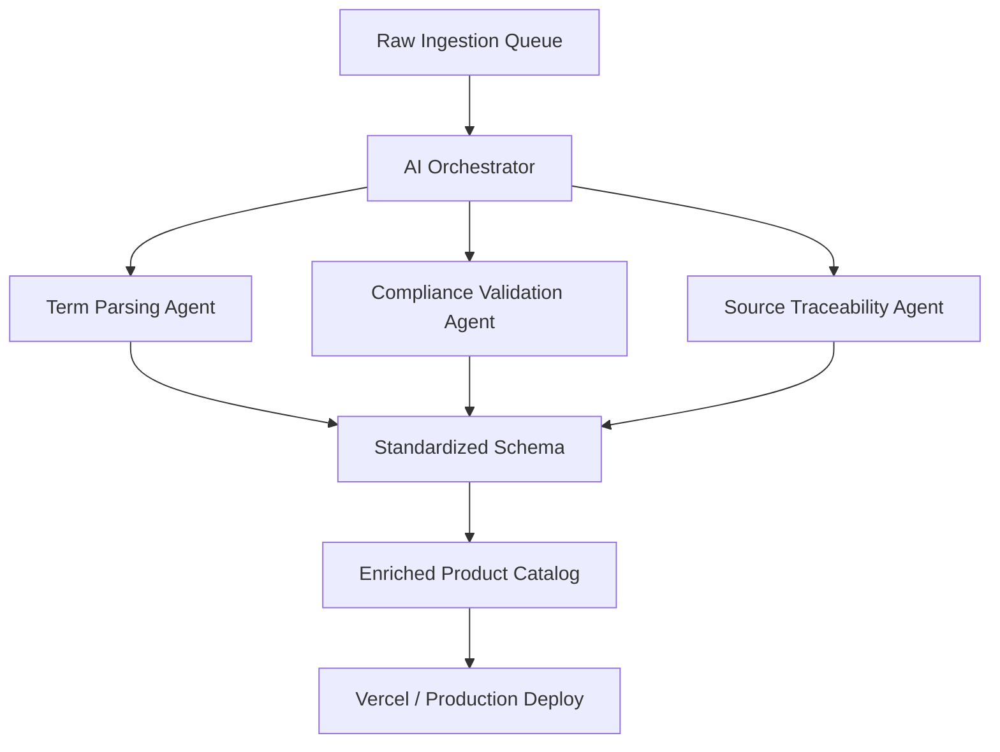

# CatalogIQ — AI-Powered Enterprise Product Catalog Ingestor

**CatalogIQ** is an enterprise-grade catalog enrichment and compliance validation platform. It structures messy, fragmented vendor data sheets into clean, standardized, and audit-ready product catalogs.

---

## ⚡ Interactive Demo Highlights

- **1,000+ Raw Products**: Ready to ingest from the pipeline queue.
- **Dynamic Terminology Standardizer**: Converts fractional values (`4-1/2"`) into structured decimals (`4.5 in`), maps unit abbreviations, and separates dimensions.
- **Safety & Regulatory Compliance Checker**: Validates products against regulatory standards (UL Listed, CSA, ANSI, NSF, Prop 65).
- **Interactive Pitch Deck**: Built-in, high-fidelity slide viewer for stakeholders.
- **Interactive Popover Profile**: Shows roles, JWT security state, and dynamic quota usage (e.g. `84% SKUs used`).

---

## 🏢 Architecture Overview

CatalogIQ utilizes a **Multi-Agent Orchestrator** to run parallel sub-agents over unstructured raw vendor records:



1. **Term Parsing Agent**: Resolves mismatched measurements (`5"` vs `5 in`), fractions, and trade naming.
2. **Compliance Validation Agent**: Scans description text for certifications (`UL`, `NSF`, `CEE`) and inserts safety warning flags (e.g., Prop 65 warnings).
3. **Source Traceability Agent**: Annotates every generated cell with source links and confidence metrics.

---

## 🚀 Getting Started

### 1. Installation
Clone the project and install all node packages:
```bash
npm install
```

### 2. Run Local Development Server
Launch the local Turbopack hot-reloaded development server:
```bash
npm run dev
```
Open [http://localhost:3000](http://localhost:3000) to view the application.

### 3. Verify Code Quality & Format
Ensure type safety and formatting checks pass:
```bash
# Run Biome lint & formatter checks
npx biome check --write .

# Build local production bundle
npm run build
```

---

## ☁️ Vercel Deployment Verification

CatalogIQ is **100% Vercel-ready**:
- **Fully Client-State Compatible**: Uses memory states for simulated databases, which removes the need for database credentials at deployment.
- **Build Optimized**: Compiles on Next.js 16 (Turbopack) under **8 seconds**.
- **Static Ingestion Queue**: Raw products are read from a dynamic CSV string parser, avoiding heavy remote payload latency.

### Deployment Steps:
1. Push your local Git commits to your repository branch:
   ```bash
   git push origin master
   ```
2. Import the repository in [Vercel](https://vercel.com/new).
3. Leave default build configurations (`Next.js` framework preset, `npm run build` build command).
4. Click **Deploy**. Vercel will build and serve CatalogIQ instantly on a secure edge server.
